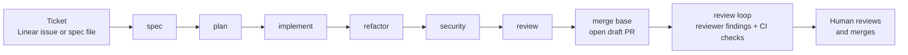
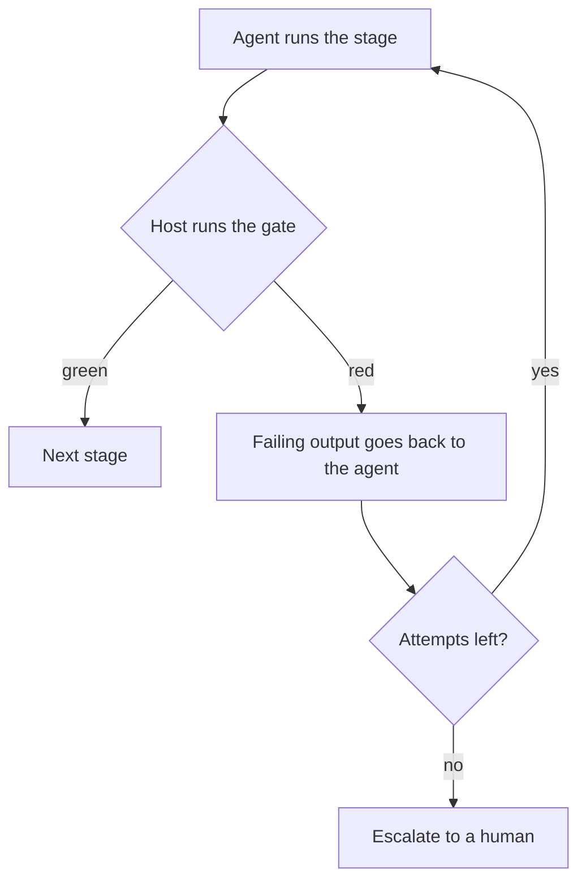
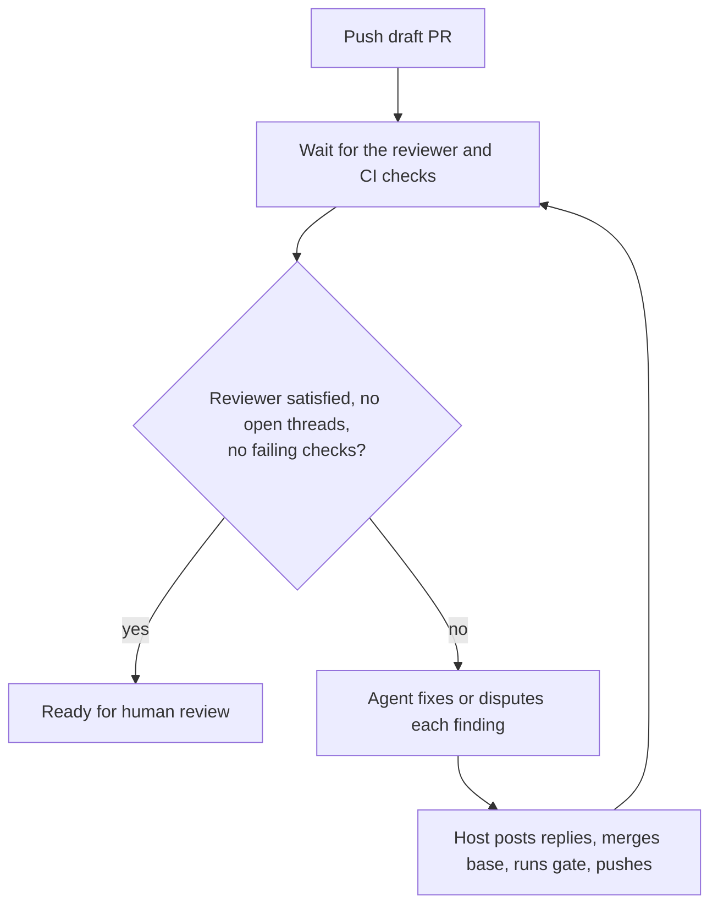

# fabrika

[](https://www.npmjs.com/package/@perkzen/fabrika)
[](https://github.com/perkzen/fabrika/actions/workflows/ci.yml)
[](https://nodejs.org)
[](LICENSE)

A local software factory. A ticket goes in, a reviewed draft pull request
comes out.

fabrika drives the real `claude` binary on your existing Claude Code login.
No API keys, no containers, no custom auth. Every stage is a headless
`claude -p` run; the host machine does the verifying, merging and pushing.



## Status

Early. `init` and `run` work end to end up to the draft PR on a scratch repo,
including resume from saved state. The six-stage pipeline and the automated
review loop have not yet run on a real ticket. `sync` discovery and its dry run
have been exercised against a real repository; its workers have not. Expect
rough edges.

## Prerequisites

- Node and [pnpm](https://pnpm.io)
- The [Claude Code](https://docs.anthropic.com/en/docs/claude-code) CLI, logged in (`claude auth login`)
- The [GitHub CLI](https://cli.github.com) (`gh`), authenticated against the target repo
- Only for `review.provider: "cubic"`: the [cubic](https://cubic.dev) review bot installed on the target repo. A repo without one sets `"none"`, which `init` does on its own, and its runs are decided by CI alone
- For Linear tickets: a Linear API key in `~/.config/fabrika/.env` as `LINEAR_API_KEY=...`

## Quick start

Install fabrika once (needs Node 24 or newer):

```bash
npm install -g @perkzen/fabrika
```

Or run it without installing:

```bash
npx @perkzen/fabrika init
```

fabrika treats the current directory as the target repo. Its own skills ship
inside the package and load through `--plugin-dir`, so the target repo needs
nothing installed.

To work on fabrika itself, clone it and run the CLI straight from source
(Node strips the types, so there is no build step in the loop):

```bash
git clone https://github.com/perkzen/fabrika.git && cd fabrika && pnpm install && node src/cli.ts --help
```

Then, inside the repo you want to work on:

```bash
fabrika init
```

This reads the repo before it writes `.fabrika/config.json`: the default
branch, the install command from your lockfile, and the gate — the checks CI
already enforces on a pull request, each one run once to prove it is green on
an untouched checkout. It prints where every step came from and what it
dropped, because a gate step that does not pass here would hand the agent
"fix it" for code it never wrote. It runs those commands in your checkout, so
expect it to install dependencies and leave whatever `build` normally leaves.

Read the gate, correct anything it guessed wrong, set the branch-name pattern
(`{user}` in it is your `git config user.name`, kebab-cased), and commit the
file. The gate for a repo belongs in that repo.

Run a ticket from either source:

```bash
fabrika run PAR-123
```

```bash
fabrika run --file spec.md
```

The last log line of a clean run is the PR URL. If the run stops, rerun the
same command and it picks up where it left off.

Draft PRs wait for a human, and while they wait the base moves. When one goes
conflicted, sweep them:

```bash
fabrika sync --dry-run
```

```bash
fabrika sync
```

One pass over every open pull request you authored on this repository: the
conflicted ones that target your base and whose branch is not checked out
anywhere on this machine get their own worktree, run directory and agent
session, and are merged, gated and pushed. Everything else is reported with
the rule that skipped it — a pull request that is merely behind is left for
the human who is going to read its diff.

`--dry-run` prints exactly that selection and changes nothing; reach for it
first, because filtering by author deliberately includes your hand-written
branches. `--concurrency <n>` (default 2) is how many run at once. One line
per pull request on your console, each worker's full log in its own
`log.txt`, and the counts on the last line.

Before trusting a real ticket to it, run `pnpm smoke` in the fabrika checkout.
It proves the `claude` CLI behaviours the pipeline depends on.

## How it works

### Every code stage must pass your gate

The gate is the list of commands in your config. The host runs them after every
stage that changes code. The agent's own "done" is never trusted.



### The PR is done when the reviewers are happy

After the draft PR opens, the host watches the reviewer and CI. The agent
only fixes.



A round takes one of two shapes. With `review.provider: "cubic"`, the host
waits for the bot's review of the pushed commit and the round turns on its
score, its open threads and the checks together. With `"none"` there is no bot
to wait for, so the reviewer is satisfied by construction and the round turns
on the checks alone: the host still waits for them to settle, still hands a
failing one's log to the agent that wrote the code, and still escalates after
`review.maxRounds`. The run finishes either way — it just claims no score it
did not seek.

A failed CI run is rerun once first, for flakes. The host never resolves a
thread the agent did not address.

### Keeping the machine awake

A run is mostly waiting — on an agent call, on the reviewer, on CI — and a Mac
that goes to sleep takes every one of those waits with it. Set `keepAwake` and
the run holds the machine up for its own lifetime:

```json
{
  "keepAwake": true
}
```

macOS only: it is `caffeinate -dimsu` watching fabrika's own pid, so it stops
the moment the run does, whether that is a clean finish, an escalation or a
Ctrl-C. Off by default, because `.fabrika/config.json` is committed and this is
one machine's preference. On anything but macOS it warns once and runs on.

### A notification when the run ends

A run is long enough to walk away from. Set `notify` and macOS gets the
outcome in Notification Center the moment the run is over:

```json
{
  "notify": true
}
```

It fires however the run ends — the `done:` line, an escalation, a usage
limit, a crash, a Ctrl-C — because the surface that posts it closes with the
run rather than waiting for a verdict the run may never reach. The ones with
no verdict of their own say only that it stopped; the reason is in the
terminal and in `log.txt`. A rerun of a ticket that is already finished posts
nothing. Off by default, macOS only, same as `keepAwake`.

The title carries the outcome — ✅ ready, ⚠️ escalated, 🛑 stopped without a
verdict — and the notification carries fabrika's own icon.

Getting that icon takes one thing fabrika otherwise never does. A notification
is posted by an app and wears that app's icon; an AppleScript call is posted
by Script Editor and there is no flag that changes it. So the first run with
`notify` on builds a bundle that *is* fabrika: it downloads
[terminal-notifier 2.0.0](https://github.com/julienXX/terminal-notifier),
checks it against a pinned SHA-256, renames it and swaps in fabrika's icon,
and keeps the result in `~/.fabrika/notifier/`. One download per machine —
later runs reuse it, and the run says so in its log when it builds one.

That release is from 2017, and deliberately so. The current one posts through
`UNUserNotificationCenter`, and macOS grants no notification permission there
to an app it has not notarised — its author's own signed build is refused on
the same machine a rebranded one is. 2.0.0 posts through the deprecated
`NSUserNotification`, where macOS asks you directly and honours the answer,
and that is the only route open to a bundle built on the machine it runs on.
It is borrowed time: the binary is x86_64, so it runs under Rosetta and macOS
already warns about it. When Rosetta or that API goes, runs stop notifying —
they do not break.

Nothing about that is allowed to cost a run, and nothing about it is faked
either. No network, a digest that does not match, a missing PlistBuddy: the
run says so in its log and does not notify. There is no second way to post —
the alternative would be an AppleScript call wearing Script Editor's name and
icon, and a notification that looks like it came from another app is worse
than the run saying nothing. macOS asks once whether "fabrika" may notify, as
it does for any app; decline and the feature is off until you change it in
System Settings → Notifications.

### Principles

- **Humans own both ends.** People write tickets and people merge PRs. No auto-merge, no writes to the ticket tracker.
- **Invariants are mechanism, not prose.** `git push`, `gh pr merge` and thread resolution are denied to the agent through Claude Code's tool rules. The host does them.
- **Unattended means recorded.** No stage can ask a question. Where a skill would normally ask, it decides and writes the decision down, so the human reviews a list of assumptions rather than a mystery.
- **Stages are data.** Adding a stage is one entry in the config, not code.
- **Method lives in skills.** Each stage prompt is a few lines naming a `fabrika:<skill>`. fabrika ships the skills itself, so a target repo needs nothing installed.
- **Small commits.** One commit per red-to-green cycle, one per finding fixed.

## Tickets

A ticket is a small record: an identifier, a title, a description. It can come
from a Linear issue or from a local markdown file; the pipeline cannot tell the
difference.

A spec file is markdown with optional frontmatter:

```markdown
---
id: login-timeout   # optional; default: the filename stem
type: fix           # optional; feat | fix | chore, default feat
linear: PAR-412     # optional; becomes the identifier and links the branch
---
# Login times out on slow networks

<the spec>
```

The `fabrika:to-tickets` skill can split a larger spec or conversation into
such files under `.fabrika/tickets/<feature>/`, so a feature becomes runnable
tickets without touching your team's Linear.

## Stages

The default pipeline. Each stage writes its artifact to `.fabrika/work/` in
the worktree, and the whole folder is copied next to the run's logs when the
run finishes.

| Stage | Skill | Output |
| --- | --- | --- |
| spec | `fabrika:to-spec` | `spec.md` with problem, solution, user stories and recorded assumptions |
| plan | `fabrika:plan` | `plan.md` with ordered vertical slices and decisions from a self-grill |
| implement | `fabrika:implement`, `fabrika:tdd` | code, one commit per red-to-green cycle |
| refactor | `fabrika:improve-codebase-architecture` | `refactor.md`, refactor commits scoped to the branch — `feat` tickets only, by default |
| security | `fabrika:security` | `security.md`, High and Medium findings fixed |
| review | `fabrika:code-review` | `review.md` and `pr.md`, which becomes the PR body |

Review rounds use `fabrika:tdd` for fixes, `fabrika:fix-ci` for failing
checks, and `fabrika:resolving-merge-conflicts` when merging the base
conflicts. See [skills/README.md](skills/README.md) for every skill and what
it reads and writes.

The skills are adapted from [Matt Pocock's skills](https://github.com/mattpocock/skills)
(MIT), with the interactive checkpoints replaced by recorded decisions.

## Where things live

- `.fabrika/config.json` in the target repo: base branch, branch pattern, gate, stages, denied tools, review settings, `keepAwake`, `notify`, PR captures
- `~/.fabrika/worktrees/<repo>/<ticket>/`: the worktree for a run
- `~/.fabrika/runs/<repo>/<ticket>/`: `state.json`, `log.txt`, raw agent transcripts, and the copied `work/` artifacts
- `~/.fabrika/captures/<repo>/<base sha>/`: the base half of each PR capture, reused by every ticket cut from that commit
- `~/.fabrika/notifier/Fabrika.app`: the bundle notifications are posted through, built on first use
- `~/.config/fabrika/.env`: secrets, kept out of every repo

For source layout, exit codes, MCP and Linear setup, the smoke test and other
operator notes, see [docs/internals.md](docs/internals.md).

## Deliberately not doing

Containers. Custom auth or OAuth handling. Parallel multi-agent fan-out.
Auto-merge. Ticket-tracker writes.
